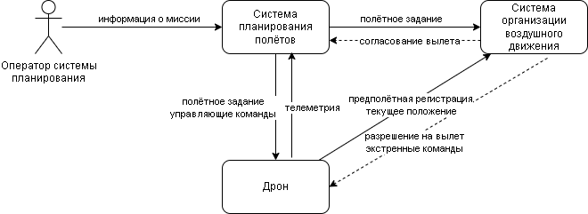
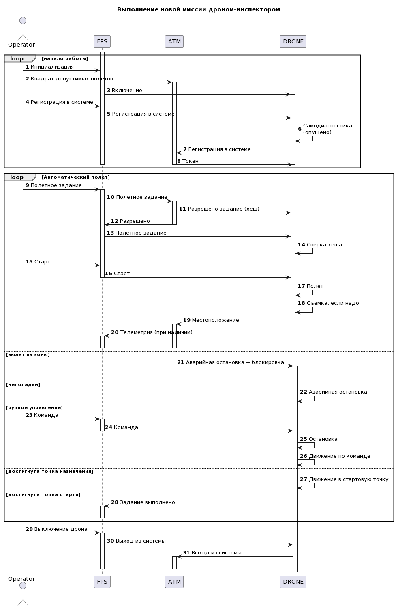

# Общая информация

Этот проект представляет собой заготовку для задачи "Дрон-инспектор" и предназначен для получения представления об интерфейсе взаимодействия компонентов, возможных способах реализации их минимального функционала, его объеме и т.д.

# Оговорка разработчика и условия использования

Пример является отправной точкой работы, но не обязательно является образцом "хорошо" или "правильно" и может быть изменен и расширен участниками в своих реализациях.

Применять только в учебных целях. Данный код может содержать ошибки, авторы не несут никакой ответственности за любые последствия использования этого кода.
Условия использования и распространения - MIT лицензия (см. файл LICENSE).

## Настройка и запуск
Предполагается, что настройка и подготовка хостовой и гостевой машины были осуществлены в соответствии с инструкциями, приведенными в подготовительном курсе https://stepik.org/course/133991/promo.

### Системные требования

Данный пример разработан и проверен на ОС Ubuntu 20.04.5, авторы предполагают, что без каких-либо изменений этот код может работать на любых Debian-подобных OS, для других Linux систем. Для MAC OS как минимум необходимо использовать другой менеджер пакетов. В Windows необходимо самостоятельно установить необходимое ПО или воспользоваться виртуальной машиной с Ubuntu (также можно использовать WSL версии не ниже 2).

### Используемое ПО

Стандартный способ запуска демо-версии предполагает наличие установленного пакета *docker*, а также *docker-compose*. Для автоматизации типовых операций используется утилита *make*, хотя можно обойтись и без неё, вручную выполняя соответствующие команды из файла Makefile в командной строке.

Другое используемое ПО (в Ubuntu будет установлено автоматически, см. следующий раздел):
- python (желательно версия не ниже 3.8)
- pipenv (для виртуальных окружений python)

Для работы с кодом примера рекомендуется использовать VS Code или PyCharm.

В случае использования VS Code следует установить расширения
- REST client
- Docker
- Python

### Настройка окружения и запуск примера


Подразумевается наличие развернутой по предоставленному образцу машины с установленным и настроенным ПО, например, docker и docker-compose, с выбранным интерпретатором (детальные инструкции по настройке среды разработки представлены в подготовительном курсе, ссылка на который приведена выше).

Для запуска примера рекомендуется использовать следующую комбинацию команд в терминалах 1 и 2:

0.0 (пере)настройка окружения (один раз для проекта, перед первым запуском и выбором интерпретатора)

``` make prepare ```

1.1 (пере)сборка docker-образов

``` docker-compose build --force-rm ```
или
``` make rebuild ```

1.2 запуск примера: в контейнерах будут развернуты серверы, готовые к приему команд и начнут генерироваться и поступать необходимые сигналы

``` make run ```

1.3 просмотр логов: в консоли будет показан лог работы контейнеров

```docker-compose logs -f --tail 100```
или
```make logs```

1.4 тестирование (будет запущен тестовый сценарий проверки работы основного функционала системы)

``` make test ```

__Можно пользоваться запросами из файла request.rest__

1.5 завершение работы:

``` docker stop $(docker ps -q) ```
или
``` make stop```


### Описание системы

Система архитектурно выглядит следующим образом:





### Компоненты

| Название | Назначение | Комментарий |
|----|----|----|
|*ATM (Air Traffic Manager, Система организации воздушного движения)* | Имитатор центральной (возможно, государственной) системы управления движением дронов в общем воздушном пространстве. Получает информацию о местоположении каждого дрона, подтверждает полетное задание. | при желании можно настроить визуализации положения дронов, но в рамках хакатона это побочный функционал, на который не стоит тратить время |
|*FPS (Flight Planning System, Система планирования полетов)* | Имитатор сервиса распределения задач по дронам. Позволяет согласовывать полетное задание с системой ATM, отправлять  дронов на задание, задавать режимы полёта. Получает данные телеметрии от дрона. | - |
|*drone (Drone, Дрон)* | имитатор дрона-инспектора, получает команды от операторов через FPS, выполняет их, обрабатывает и передает данные от встроенных датчиков на пульт управления, а также информацию о местоположении в АТМ. | - |


Диаграмма последовательности этого примера выглядит следующим образом:



[ссылка на исходник диаграммы](https://www.plantuml.com/plantuml/uml/bLLTQnDH47tVNt7fKqlSFo0Y5TGthQYFlgpj2eKq6vBjUvfGFmnKAO9IH6j_mUt7cZH9DtzXvXzv3dTpkziLJGlRqfcvvyoSENjtlPj6dNHtfna4wNRQZCsA7EfGvfBBLAuampEMpE1FBcTuBetCPAnxkeVusCY5zX1bTXOYSeNu7AScsfSSAOHNWcWpJJh6_Moquqx4VwEkIO8skBStjzjHApMFdxrWy4sxMma_UFc4uIZTgOGVFjzu-eY9hKxIYeCWsasJrkxEwxWJ1CqaQRDZg-_4OepSe1Chf-YehyC038r6a9ZmFidk6ld68VMjZ5cDtoEn_4y_kI9GDneeEu80bWCZtSVa66wk0qZHnvcP3dNV5Bfb244kCW70jKW8EPI9JFK0VIs4BVTnZEWvU8584jU3aJEZUowA_4oo2kmjZh4-BX_y9HQ979DmydDkiPXc8jQOLwtLOiGFaZ6vvY6eoIsOKLtcFG7iX91CX27d2KE7ZRznQsknmizoHYM1OTaMPGFo10rUbgJs4b9Y-Ra8isCwTyIbuQ7UNZiGBrEDike2Zv4QQGydtZjDRfmmgxhFv1gF-itMZrrFxl7_tqrzWN1a1bYko_6AzMg48Ik0PRMd_GhLZLGGDxjn7TrtynTY_SZLalYEuLButl2LOxkvh_SoVsSDL-csXkStpbUdyXiyGMhgd4DV2Jsr2X_s5XHJMe7NprhPG6uC0yiCNTk6hp8qvFsamuBdNkYRWhie0Dr4MB0K_hV5RKTP6qPEsJ1TXzeYJ5xFYEhCpSNnMLWJR2ck0Wuh6M0yvm0TS72ng9XwnIf-FtBl1r8mIjLGzIHaglVsezP8hUGB4kFhdHcEQsHIGiyMObpuI-GSiW-8RBXvZ0Hejy0HVxjBaDjTWezNoiAlR1F01nvM1ykHbp5itNTVAoyoEAgVmTpRhBLLNG4-cBLxtNyOQpj1jUxprdN-B5-LEgo_ElykToqvDwwZCNp8_m00)
