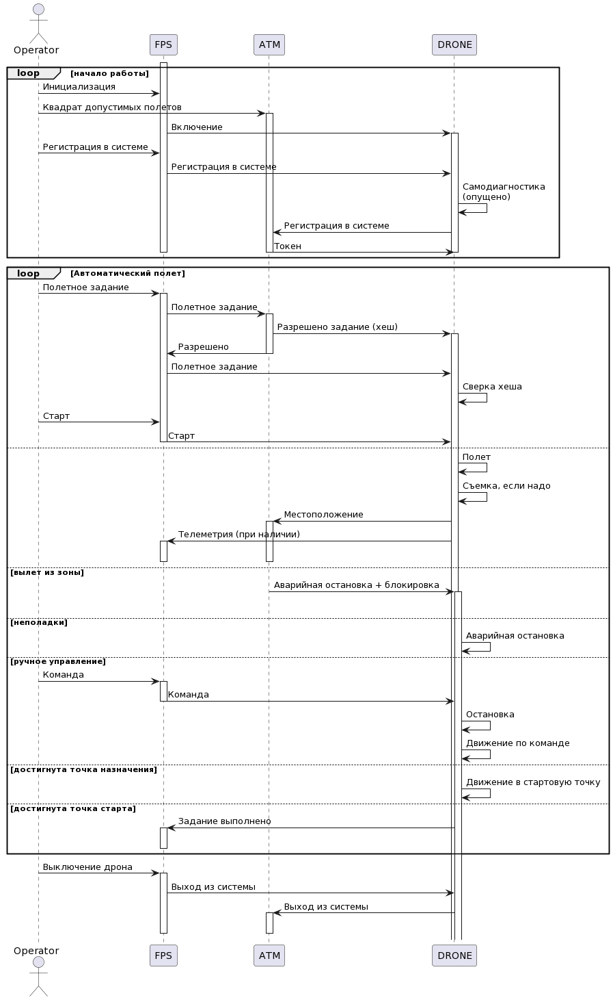

# Условия использования 

Этот проект представляет собой заготовку, MVP, для задачи "Дрон-наблюдатель" и предназначен для получения представления о интерфейсе взаимодействия компонентов, возможных способах реализации их минимального функционала, его объеме и т.д. Таким образом, пример является отправной точкой работы, но не обязательно является образцом "хорошо" или "правильно" и может быть изменен и расширен участниками в своих реализациях.

Применять только в учебных целях. Данный код может содержать ошибки, авторы не несут никакой ответственности за любые последствия использования этого кода.
Условия использования и распространения - MIT лицензия (см. файл LICENSE).

## Настройка и запуск
Предполагается, что настройка и подготовка хостовой машины были осуществлены в соответсвии с инструкциями, приведенными в подготовительном курсе https://stepik.org/course/133991/promo.

### Системные требования

Данный пример разработан и проверен на ОС Ubuntu 20.04.5, авторы предполагают, что без каких-либо изменений этот код может работать на любых Debian-подобных OS, для других Linux систем. Для MAC OS как минимум необходимо использовать другой менеджер пакетов. В Windows необходимо самостоятельно установить необходимое ПО или воспользоваться виртуальной машиной с Ubuntu (также можно использовать WSL версии не ниже 2).

### Используемое ПО

Стандартный способ запуска демо-версии предполагает наличие установленного пакета *docker*, а также *docker-compose*. Для автоматизации типовых операций используется утилита *make*, хотя можно обойтись и без неё, вручную выполняя соответствующие команды из файла Makefile в командной строке.

Другое используемое ПО (в Ubuntu будет установлено автоматически, см. следующий раздел):
- python (желательно версия не ниже 3.8)
- pipenv (для виртуальных окружений python)

Для работы с кодом примера рекомендуется использовать VS Code или PyCharm.

В случае использования VS Code следует установить расширения
- REST client
- Docker
- Python

### Настройка окружения и запуск примера

Подразумевается наличие развернутой по предоставленному образцу машины с установленным и настроенным ПО, например, docker и docker-compose, с выбранным интерпретатором (детальные инструкции по настройке среды разработки представлены в подготовительном курсе, ссылка на который приведена выше).

Для запуска примера рекомендуется использовать следующую комбинацию команд в терминалах 1 и 2:

0.0 make prepare (один раз для проекта, перед первым запуском и выбором интерпретатора)

1.1 docker-compose build --force-rm

1.2 make run (В контейнерах будут развернуты серверы, готовые к приему команд и начнут генерироваться и поступать необходимые эмулируемые сигналы)

2.1 docker-compose logs -f --tail 100 (в консоли будет показан лог работы контейнеров)

1.3 make test (Будет запущен тестовый сценарий проверки работы основного функционала системы)

__Можно пользоваться запросами из файла request.rest__

1.4 docker stop $(docker ps -q) (завершение работы)

### Описание системы

Система архитектруно выглядит следующим образом:

### Компоненты

| Название | Назначение | Комментарий |
|----|----|----|
|*atm (Air Traffic Manager, Система организации воздушного движения)* | Эмулятор системы диспетчеризации дронов на предприятии. Получает информацию о местополежнии каждого дрона, визуализирует информацию, подтверждает полетное задание. | Для визуализации используется вспомогательный файл *coordinates* в *storage* и библиотека matplotlib с некоторыми специализированными параметрами для доступа к дисплею изнутри контейнера. При возникновении ошибок с этим функционалом достаточно просто отключить вызов метода *show\show2* в *atm\atm.py\main* |
|*fps (Flight Planning System, Система планирования полетов)* | Эмулятор сервиса управления дронами оператором. Позволяет согласовывать полетное задание с диспетчерской, включать новых дронов, управлять ими в ручном или автоматическом режиме. Получает данные телеметрии от дрона. | - |
|*drone (Drone, Дрон)* | Непосредственно дрон-наблюдатель, получает команды от операторов (fps), выполняет их, обрабатывает и передает данные от встроенных датчиков (камера) на пульт управления, а также информацию о местоположении в диспетчерскую. | - |

Диаграмма последовательности этого примера выглядит следующим образом:

