# Отчёт о выполнении задачи "Дрон-инспектор"

- [Отчёт о выполнении задачи "Дрон-инспектор"](#отчёт-о-выполнении-задачи-дрон-инспектор)
  - [Постановка задачи](#постановка-задачи)
  - [Известные ограничения и вводные условия](#известные-ограничения-и-вводные-условия)
    - [Цели и Предположения Безопасности (ЦПБ)](#цели-и-предположения-безопасности-цпб)
  - [Описание системы](#описание-системы)
    - [Компоненты](#компоненты)
    - [Алгоритм работы решения](#алгоритм-работы-решения)
    - [Описание Сценариев (последовательности выполнения операций), при которых ЦБ могут нарушаться](#описание-сценариев-последовательности-выполнения-операций-при-которых-цб-могут-нарушаться)
    - [Политики безопасности](#политики-безопасности)
  - [Запуск приложения и тестов](#запуск-приложения-и-тестов)
    - [Запуск приложения](#запуск-приложения)
    - [Запуск тестов](#запуск-тестов)
    - [Ожидаемый результат](#ожидаемый-результат)

## Постановка задачи

Компания создаёт дрон для мониторинга трубопроводов, тянущихся на сотни километров в том числе по горам, лесам и пустыням. Поэтому нужна функция автономного выполнения задачи. 
При этом даже в горах летает гражданская авиация (те же вертолёты экстренной медицинской помощи), очень бы не хотелось, чтобы, например, дрон компании врезался в вертолёт с пациентами. Поэтому тяжёлые автономные дроны должны летать в контролируемом воздушном пространстве, координацию полётов в котором осуществляет система организации воздушного движения (ОрВД).

В рамках хакатона участникам предлагается: 
- доработать предложенную архитектуру (см. далее) бортового обеспечения дронов-инспекторов с учётом целей безопасности
- декомпозировать систему и отделить критический для целей безопасности код
- в бортовом ПО нужно внедрить компонент "монитор безопасности" и реализовать контроль взаимодействия всех подсистем дрона
- доработать функциональный прототип 
- создать автоматизированные тесты, демонстрирующие работу механизмов защиты


## Известные ограничения и вводные условия
1. По условиям организаторов должна использоваться микросервисная архитектура и шина обмена сообщениями для реализации асинхронной работы сервисов.
2. Между собой сервисы ПЛК общаются через шину сообщений (message bus), а всё "снаружи" принимают в виде REST запросов.
3. Физическая надёжность аппаратуры (ПЛК и всего остального производства) и периметра не учитывается.
4. Графический интерфейс для взаимодействия с пользователем не требуется, достаточно примеров REST запросов.
5. Персонал, обслуживающий систему, благонадёжен.


### Цели и Предположения Безопасности (ЦПБ)

#### Цели безопасности:

1. Выполняются только аутентичные задания на мониторинг 
2. Выполняются только авторизованные системой ОрВД задания 
3. Все манёвры выполняются согласно ограничениям в полётном задании (высота, полётная зона/эшелон) 
4. Только авторизованные получатели имеют доступ к сохранённым данным фото-видео фиксации 
5. В случае критического отказа дрон снижается со скоростью не более 1 м/с 
6. Для запроса авторизации вылета к системе ОрВД используется только аутентичный идентификатор дрона 
7. Только авторизованные получатели имеют доступ к оперативной информации

#### Предположения безопасности:

1. Аутентичная система ОрВД благонадёжна
2. Аутентичная система планирования полётов благонадёжна
3. Аутентичные сотрудники благонадёжны и обладают необходимой квалификацией
4. Только авторизованные сотрудники управляют системами
5. Аутентичное полётное задание составлено так, что на всём маршруте дрон может совершить аварийную посадку без причинения неприемлемого ущерба заказчику и третьим лицам


### Описание системы

Изначально, в общем виде контекст работы выглядел следующим образом:


В ходе решения она была детализирована до следующей:

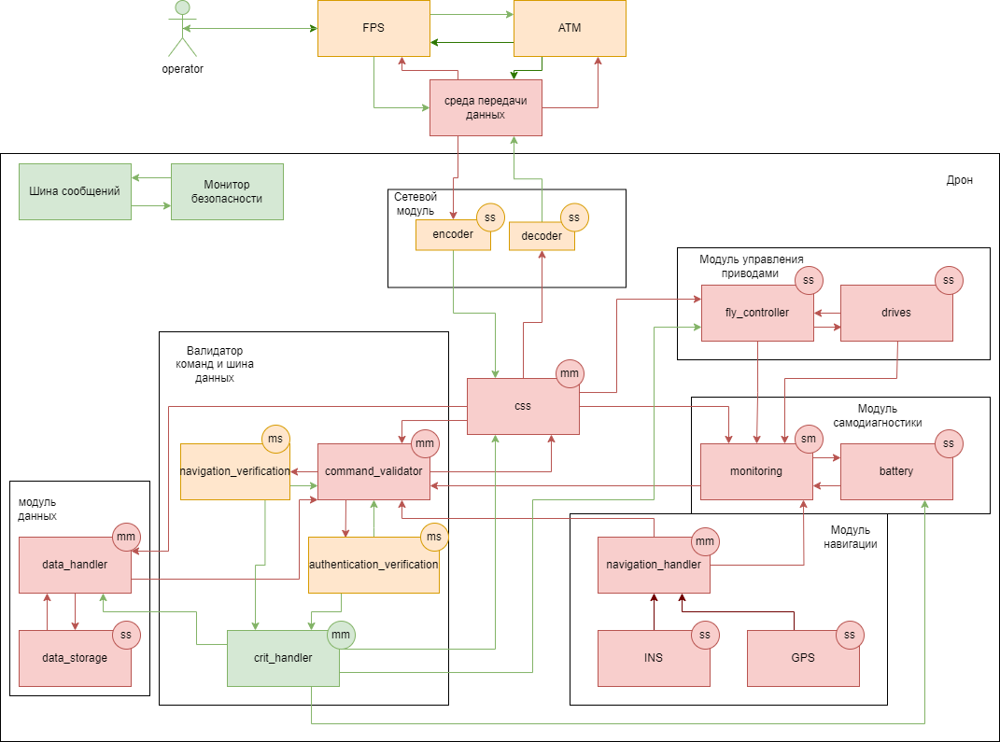

Вот упрощенная версия:

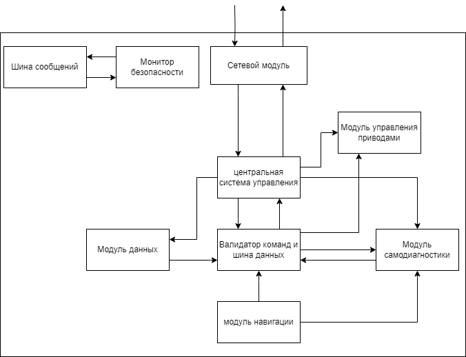

### Компоненты
| Название | Назначение | Комментарий |
|----|----|----|
|*ATM (Air Traffic Manager, Система организации воздушного движения)* | Имитатор центральной (возможно, государственной) системы управления движением дронов в общем воздушном пространстве. Получает информацию о местоположении каждого дрона, подтверждает полетное задание. | - |
|*FPS (Flight Planning System, Система планирования полетов)* | Имитатор сервиса распределения задач по дронам. Позволяет согласовывать полетное задание с системой ATM, отправлять  дронов на задание, задавать режимы полёта. Получает данные телеметрии от дрона. | - |
|*decoder(шифратор)(перепутали английские слова, переделывать много времени уйдет)* | Расшифровывает входящие зашифрованные команды и передает в CCS(центральная система управления). | Повышающий доверие, т.к. используется шифрование. |
|*encoder(дешифратор)(перепутали английские слова, переделывать много времени уйдет)* | Зашифровывает данные приходящие из CSS(центральная система управления). | Доверенный.|
|*css(central control system, центральная система управления)* | Центральный блок управления. Выполняет функцию раздатчика комманд, при условии, что валидатор комманд разрешил их передать.  | Повышающий доверие, т.к. общается с валидатором комманд. |
|*fly_controller(полётный котроллер)* | Управляет приводами. | Недоверенный. |
|*drives(приводы)* | Включаются и выключаются по командам. | Недоверенный. |
|*monitoring* | Проводит самодиагностику и мониторинг состояния "хардверных" компонентов. | Недоверенный. |
|*battery* | Смотрит на заряд батареи и отдает значение в мониторинг | Недоверенный. |
|*navigation_handler(обработчик навигационных данных)* | Обрабатывает навигационные данные от ИНС и GPS и передает в шину данных. | Повышающий доверие, т.к. использует алгоритмы для улучшения данных на основе двух источников. |
|*INS(Инс)* | Имитатор системы ИНС. | Недоверенный. |
|*GPS* | Имитатор системы GPS. | Недоверенный. |
|*data_handler(обработчик данных)* | Внутри себя имеет камеру, обрабатывает фото и видео для последующей передачи, шифрует данные. | Недоверенный. |
|*data_storage(хранилище данных)* | Хранит зашифрованные данные. | Недоверенный. |
|*command_validator(валидатор комманд и шина данных)* | Управляет данными. Выдает только после успешной проверки соседними компонентами(проверка на аутентичность и авторизованность, уточнение навигации), так же отправляет на проверку команды CSS. | Недоверенный. |
|*navigation_verification(валидация навигационных данных)* | Проверяет сходятся ли текущие навигационные данные с заданным маршрутом. | Повышающий доверие, т.к. сравнивает данные маршрута и геолокацию. |
|*authentication_verification(проверка команд на аутентичность и авторизованность)* | Проверяет аутентичны ли команды с помощью какой нибудь подписи или ключа. | Повышающий доверие, т.к. проверяет данные. |
|*crit_handler(Обработчик критических ситуаций)* | При условии, что какая-нибудь из проверок неуспешна, перехватывает управление полетным контроллером или отключает питание с батареи. | Доверенный. |

### Операции
| Назначение           | Источник             | Канал | Операция                  | Параметры |
|----------------------|----------------------|:-----:|---------------------------|---|
| **Cutoff**           | **IAM**              | MB    | `hard_stop`               | 🟢 |
| **Cutoff**           | **PLC control**      | MB    | `hard_stop`               | 🟢 |
| **Downloader**       | **Update manager**   | MB    | `request_download`        | `module_name`                   |

### Алгоритм работы решения

Диаграмма последовательности этого примера выглядит следующим образом:


[ссылка на исходник диаграммы](https://www.plantuml.com/plantuml/uml/xLZTRjis5BxdKn2vRVm2mJ1qDnjsiM70TcaWK6F55M1BWQq4w5tiDakA53LM3DYkXWtO0yYkLRjnxBq2-KRxU4I18IKgph8DAE0BsHJFTtvuVWv9FHscmI0zxVTO6gMzaE-9T_9Q_2KsOYNM8iUp53aN2v69EHwyoiaUOy5fciId_MVXW9s0FpgAJe8uvNjVVlVz7W-6_FXaQ1E--E4R8WHftoQ4yL7I2GT4r6CRq0aD0ECgu6Wu92B-7KBIxmTnv_0iw4MT84qA6PLPcmahUnx6U0_IA8aFpy91TAnVYBs1RWkAWxEewn7YeJdc3wBqy3bCxUdLtvtmwR8Ot6cNxUjlYsX5iUEvhtGOksuOZtil3e-IE1qalLA9FUN4RX2TXKLqYg533jB0ClZkH0rqY6W5tT10zOGDxITnXFaexXBGlDgmPq6QXeCNXD5ZnbXta9oUSF4hPVgFIFvC_Se95pFKnKhaSYmoXlJchS_BV3tWHS78dq1SOsGNZCYP1e97PUdzU820hQOgSURoNEGAB2z5niKD1DmIvrnUSyolv0GmW3PYfi10B5b55EGtvVA1Ao9Z3MYFiVAb7971LsgPzJPWgIvmdujRQFwWnl2xwKTo8iVoJUcTJgYzJ_vuZoYDG3wlZvW6qwhJ_fCdst75IHho12jLJFky5CAyl73KIhvLWL4ICC7b2D0fYAp54Tkvwgbo3FWhlC6j66_aEKXSR81TaylNi25NiSwKT7WZLteel2eeG6NDukm4WwaRfuVlSunc1HgS2r8Bce7_1i8xyJDojyEL7nXSeDrNJGxOqexhlTAEZKlBV5sB6mKsrW5aLaQAJ7crMXIiJ2o8vyhiIW3VYPTJPOZnVNNMZhUHsrYDksgCOl9ETQ-fSyyIR2FMFTcU1LXM1Jua7fJYSwLQbGSAacDkIf6VWZO6a4gdoIDZoBo1NrvJWbIbocjMR72AnUmuu4Gj400-PVPMsGZLEr8ZnX1y4H-fda95Fj6vJS6RWx0aGYvklSlUafypO0qBt0hAPT7-RbK3arTuNYgxLIzXZFMI15li7s95WQB6KqgVaG3nKNK2oZj5ABiKnkz5jYl7RJP7EzMe5rPsatPSEepcNkEVzWPlyZNdiZrZKa6rNoo2N8OzHuL0lbML92-i03aY7wYzA3yij5QLo9rSU8YoGhHHSc3vdRpcAlWdtS31KbmMMCnAlYcusd5LhvpyIsq0lRb69Q_J-7-q_6evVDQgSlytBP_Kt5_rjRgOXzaJ6bUYNUpPetkpMDPlLjI8TQ-mRbtKASmnjinjyl07397VlhvSDlRVIoy3QZLqaVjOxrhWMaHBdIeu7J9LVU5PWNV1zL4EnsLvuGgnReZQNnVA65EoaEONK1-mQed8Qz-g_C5xZ1H_9TG5-fDDSCzoXlR5cz9yXKTlQiM5erNBhERfFODVrxfwg0qeYXnHYxZ676HuWW5WsN1ce5tgMuLy1H20BJLBTxBDtSi8lXRuB1NBX-I24KhNC8-Fh4ihPs86p48V6f3uT0UYiC2ECZvpwl14f-MRYnEqAYF7PERKFgsjY-M0UwKuoHiVYLUEw9w5mvMvFvfZOZKjsZ7bnOhcbX12HXAvl9YHkswfjuq0MVfxc1QVqoKpAyyr3Tqd38xIw2n8GqkC-HhqYsiBoJAcxBTZxUMPgv6kabFm8yAFFhdkJgwxa-lkvBexkUvEhhen_qa4VHeiFpXQhPbJMx4_9XewmEv6Kzrb7uB7LhyDliEUukUqt_iR)

#### Дублирование целей безопасности:

1. Выполняются только аутентичные задания на мониторинг 
2. Выполняются только авторизованные системой ОрВД задания 
3. Все манёвры выполняются согласно ограничениям в полётном задании (высота, полётная зона/эшелон) 
4. Только авторизованные получатели имеют доступ к сохранённым данным фото-видео фиксации 
5. В случае критического отказа дрон снижается со скоростью не более 1 м/с 
6. Для запроса авторизации вылета к системе ОрВД используется только аутентичный идентификатор дрона 
7. Только авторизованные получатели имеют доступ к оперативной информации


### Описание Сценариев (последовательности выполнения операций), при которых ЦБ могут нарушаться

 Взломанный модуль | Нарушенная ЦБ | Комментарий |
|----|----| ----|
| encoder | 4,7 | Фиксится большей декомпозицией сетевого модуля на более мелкие сущности |
| decoder | - | - |  
| fly_controller | 3,5 | Фиксится добавлением запасных независимых приводов или парашютом для медленного спуска или складными крыльями для пекирования |
| drives| 3,5 | Фиксится добавлением запасных независимых приводов или парашютом для медленного спуска или складными крыльями для пекирования |
| monitoring | 3,5 | Фиксится добавлением запасных независимых приводов или парашютом для медленного спуска или складными крыльями для пекирования |
| battery_status | 3,5 | Фиксится добавлением запасных независимых приводов или парашютом для медленного спуска или складными крыльями для пекирования |
| navigation_handler | 3,5 | Фиксится добавлением запасных независимых приводов или парашютом для медленного спуска или складными крыльями для пекирования |
| INS | 3 | Фиксится добавлением какого нибудь еще источника информации о текущем местоположении(wifi, bluetooth, радио) |
| GPS | 3 | Фиксится добавлением какого нибудь еще источника информации о текущем местоположении(wifi, bluetooth, радио) |
| css | - | - |
| command_validator | 3,5 | Фиксится добавлением запасных независимых приводов или парашютом для медленного спуска или складными крыльями для пекирования |
| authentication_verification | - | - |
| navigation_verification | 3,5 | Фиксится добавлением запасных независимых приводов или парашютом для медленного спуска или складными крыльями для пекирования |
| crit_handler | 3,5 | Фиксится добавлением запасных независимых приводов или парашютом для медленного спуска или складными крыльями для пекирования |
| data_storage | - | - |
| data_handler | - | - |

**Негативный сценарий 1 - Взлом encoder:**

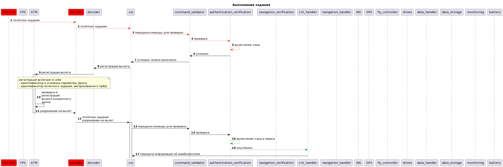


**Негативный сценарий 2 - Взлом css:**

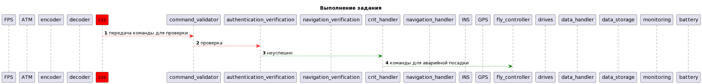


**Негативный сценарий 3 - Взлом command_validator:**

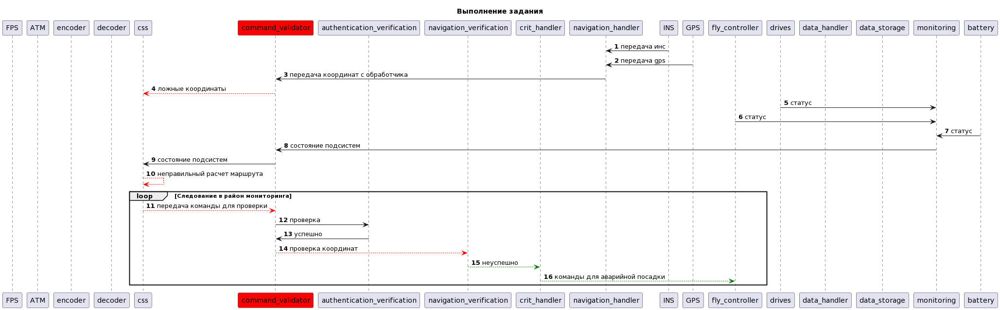


**Негативный сценарий 4 - Взлом authentication_verification:**

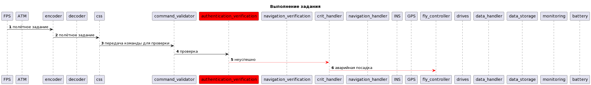


**Негативный сценарий 5 - Взлом navigation_verification:**

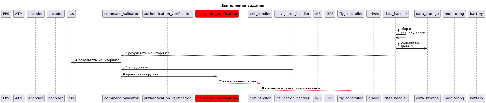


**Негативный сценарий 6 - Взлом crit_handler:**

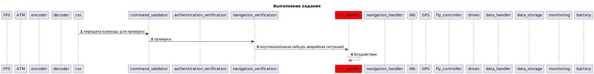


**Негативный сценарий 7 - Взлом navigation_verification:**

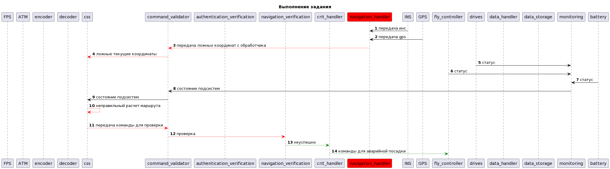


**Негативный сценарий 8 - Взлом fly_controller:**

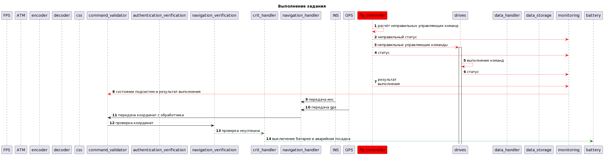


**Негативный сценарий 9 - Взлом monitoring:**

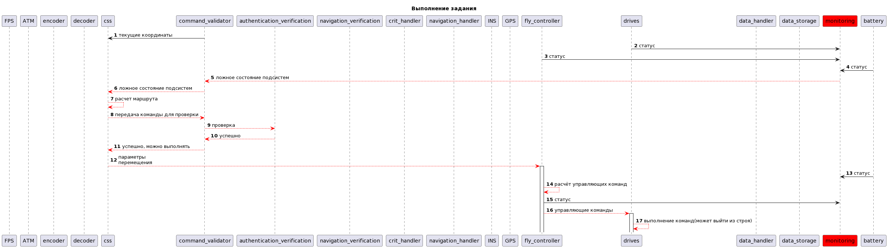


**Негативный сценарий 10 - Взлом drives:**

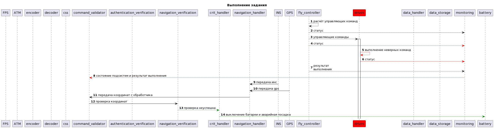


### Политики безопасности 


```python {lineNo:true}

  if src == 'drone_battery_control' and dst == 'drone_diagnostic' \
        and operation == 'battery_status':
        authorized = True
    if src == 'drone_ccu' and dst == 'drone_flight_controller' \
        and operation == 'stop':
        authorized = True
    if src == 'drone_ccu' and dst == 'drone_flight_controller' \
        and operation == 'clear':
        authorized = True
    if src == 'drone_ccu' and dst == 'drone_communication_out' \
        and operation == 'watchdog':
        authorized = True
    if src == 'drone_ccu' and dst == 'drone_data_aggregation' \
        and operation == 'camera_on':
        authorized = True
    if src == 'drone_ccu' and dst == 'drone_data_aggregation' \
        and operation == 'camera_off':
        authorized = True
    if src == 'drone_ccu' and dst == 'drone_communication_out' \
        and operation == 'log':
        authorized = True
    if src == 'drone_ccu' and dst == 'drone_flight_controller' \
        and operation == 'move_to':
        authorized = True
    if src == 'drone_ccu' and dst == 'drone_diagnostic' \
        and operation == 'get_status':
        authorized = True
    if src == 'drone_ccu' and dst == 'drone_communication_out' \
        and operation == 'register':
        authorized = True
    if src == 'drone_ccu' and dst == 'drone_communication_out' \
        and operation == 'sign_out':
        authorized = True
    if src == 'drone_ccu' and dst == 'drone_communication_out' \
        and operation == 'send_position':
        authorized = True
    if src == 'drone_ccu' and dst == 'drone_communication_out' \
        and operation == 'data':
        authorized = True
    if src == 'drone_communication_in' and dst == 'drone_ccu' \
        and operation == 'in':
        authorized = True
    if src == 'drone_data_aggregation' and dst == 'drone_ccu' \
        and operation == 'data':
        authorized = True
    if src == 'drone_data_aggregation' and dst == 'drone_data_saver' \
        and operation == 'smth':
        authorized = True
    if src == 'drone_diagnostic' and dst == 'drone_ccu' \
        and operation == 'diagnostic_status':
        authorized = True
    if src == 'drone_diagnostic' and dst == 'drone_battery_control' \
        and operation == 'get_battery':
        authorized = True
    if src == 'drone_flight_controller' and dst == 'drone_gps' \
        and operation == 'get_coordinate':
        authorized = True
    if src == 'drone_flight_controller' and dst == 'drone_ins' \
        and operation == 'get_coordinate':
        authorized = True
    if src == 'drone_flight_controller' and dst == 'drone_ccu' \
        and operation == 'reached':
        authorized = True
    if src == 'drone_flight_controller' and dst == 'drone_battery_control' \
        and operation == 'change_battery':
        authorized = True
    if src == 'drone_flight_controller' and dst == 'drone_engines' \
        and operation == 'smth':
        authorized = True
    if src == 'drone_gps' and dst == 'drone_ccu' \
        and operation == 'gps_coordinate':
        authorized = True
    if src == 'drone_ins' and dst == 'drone_ccu' \
        and operation == 'ins_coordinate':
        authorized = True  

```
## Идеи на будущее для улучшения
Для полной защиты от нарушения ЦБ 3,5 возможно использование дополнительных независимых приводов или добавление парашюта или складываемых крыльев для планирования.
Для защиты от нарушения ЦБ 4,7 при аварийной посадке, возможно использование автопорчи данных или усиленного шифрования с последующим поиском потерянного дрона с помощью его геолокации.
Для того, чтоб дроны не сталкивались друг с другом есть идея использовать вайфай точки на каждом дроне, чтоб они могли друг друга обнаружить и разойтись с миром. Потому что данные с ОрВД могут не дойти в нужный момент.


## Запуск приложения и тестов

### Запуск приложения

см. [инструкцию по запуску](README.md)

### Запуск тестов

_Предполагается, что в ходе подготовки рабочего места все системные пакеты были установлены, среда разработки настроена в соответсвии с руководством, на которое приведена ссылка выше._

Запуск примера: открыть окно терминала в Visual Studio code, в папке с исходным кодом выполнить 

**make run**
или **docker-compose up -d**

запуск тестов:
**make test**
или **pipenv run pytest**

### Ожидаемый результат

